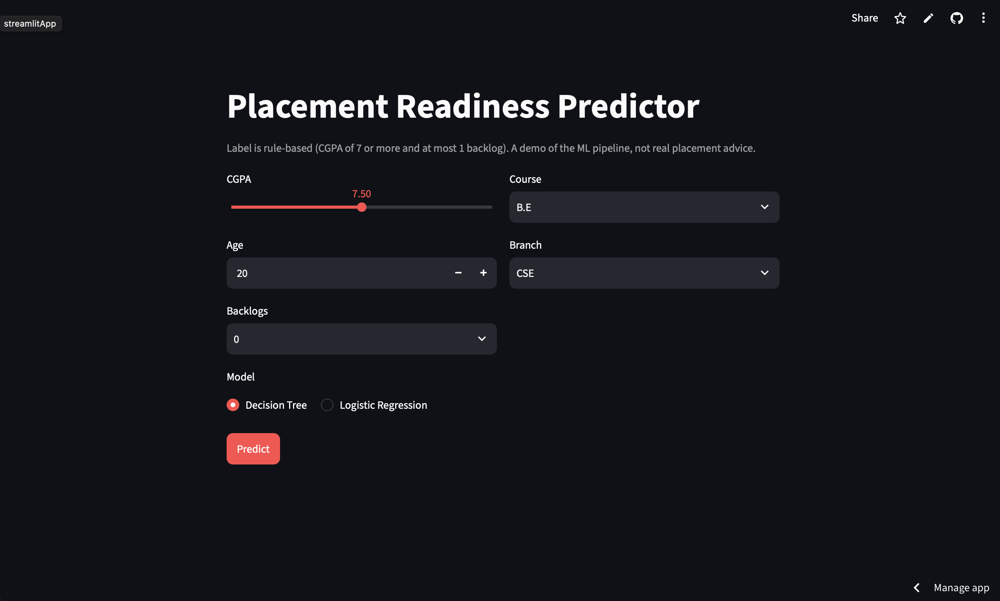

# Placement Readiness Predictor

GDG-USAR Tech Team task (AI/ML domain). A binary classifier that labels a
student "ready" or "not ready" for placement, with a small Streamlit interface.

> **Read this first:** the provided dataset has no target column. The label
> comes from a hand-made readiness score built on CGPA and backlogs, so the
> models relearn that formula. See [DECISIONS.md](DECISIONS.md).

**Live demo:** https://placement-readiness-predictor-6jc2jkcyof26uvyksymbfq.streamlit.app/



## Run it

```bash
pip install -r requirements.txt
python train.py          # cleaning, training, metrics, charts
streamlit run app.py     # input interface
```

## Pipeline

1. **Clean:** remove 9,000 exact duplicate rows (1,000 unique students left),
   fill blank `backlogs` as "0", drop identifier columns.
2. **Label:** each student gets a readiness score (below), and `ready`
   means a score of 65 or more. About 23% of students are ready.
3. **Features:** `cgpa`, `age`, `backlogs`, `course`, `branch`.
4. **Split:** 80/20, stratified, before any preprocessing.
5. **Preprocess:** scale numbers, one-hot encode categories, inside a
   scikit-learn `Pipeline` so nothing is fitted on test data.
6. **Models:** majority-class baseline, Logistic Regression, Decision Tree.

## Readiness score

| Case                                   | Score                                    |
| -------------------------------------- | ---------------------------------------- |
| CGPA below 7.0, or more than 1 backlog | 0 (not eligible)                         |
| Otherwise                              | 60 + (CGPA - 7) / 3 x 40 - 15 x backlogs |

Ready means a score of 65 or more. In practice: CGPA 7.38 or more with no
backlogs, or CGPA 8.5 or more with one backlog. The weights (60, 40, 15) and
the cutoff (65) were chosen by judgement. The score is not a probability of
being placed, and it is never shown to the model as a feature.

## Results (test set, 200 students, "ready" class)

| Model                         | Precision | Recall | F1    |
| ----------------------------- | --------- | ------ | ----- |
| Baseline (always "not ready") | 0.000     | 0.000  | 0.000 |
| Logistic Regression           | 1.000     | 0.978  | 0.989 |
| Decision Tree (max depth 4)   | 1.000     | 1.000  | 1.000 |

**Why the tree wins:** the label is a set of hard cutoffs (CGPA 7.38 with no
backlogs, CGPA 8.5 with one). A tree splits on exactly such cutoffs, so it
recovers them. Logistic Regression draws one smooth boundary, so it missed
one ready student who sits close to a cutoff.


## Example prediction

Student: CGPA 7.08, 1 backlog, B.Tech, IT, age 30.
Score: 60 + 1.07 - 15 = 46, below the cutoff of 65. True label: not ready.

- Decision Tree: 0% ready. Correct.
- Logistic Regression: 3% ready. Correct. Being in the "1 backlog" group
  pushes towards ready (+2.11) because that group is at least eligible,
  unlike 2 or 3+, but the low CGPA pushes back (-1.28) and the model's
  starting point is already well below 50%.

## Feature importance

Shuffling a column and measuring the drop in F1 (Decision Tree):

| Feature             | Drop in F1 |
| ------------------- | ---------- |
| cgpa                | 0.566      |
| backlogs            | 0.549      |
| course, branch, age | 0.000      |

The model uses only the two columns the formula is built on, as expected.


## Limits

- The label is hand-written, so scores do not show real predictive power.
- The data is synthetic.
- Not suitable for judging real students.

## Files

`train.py` (pipeline and evaluation), `app.py` (interface), `DECISIONS.md`,
`data/placement_readiness.csv`, `requirements.txt`.
