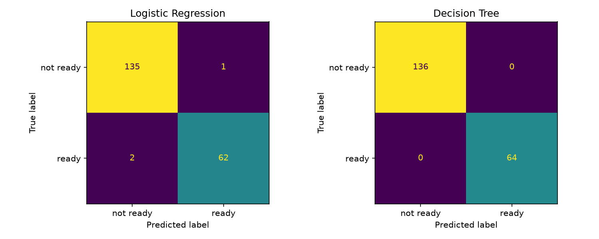
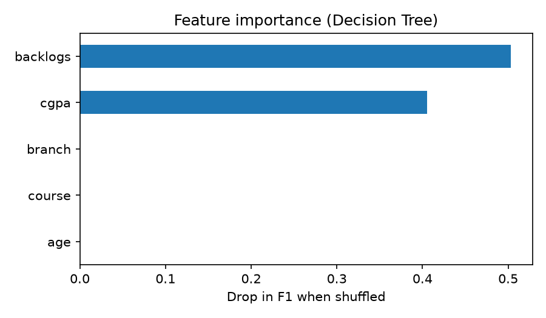

# Placement Readiness Predictor

GDG-USAR Tech Team task (AI/ML domain). A binary classifier that labels a
student "ready" or "not ready" for placement, with a small Streamlit interface.

> **Read this first:** the provided dataset has no target column. The label
> is defined by a rule (CGPA of 7.0 or more and at most 1 backlog), so the
> models relearn that rule. See [DECISIONS.md](DECISIONS.md).

## Run it

```bash
pip install -r requirements.txt
python train.py          # cleaning, training, metrics, charts
streamlit run app.py     # input interface
```

## Pipeline

1. **Clean:** remove 9,000 exact duplicate rows (1,000 unique students left),
   fill blank `backlogs` as "0", drop identifier columns.
2. **Label:** `ready` = CGPA >= 7.0 and backlogs in {0, 1}.
3. **Features:** `cgpa`, `age`, `backlogs`, `course`, `branch`.
4. **Split:** 80/20, stratified, before any preprocessing.
5. **Preprocess:** scale numbers, one-hot encode categories, inside a
   scikit-learn `Pipeline` so nothing is fitted on test data.
6. **Models:** majority-class baseline, Logistic Regression, Decision Tree.

## Results (test set, 200 students, "ready" class)

| Model | Precision | Recall | F1 |
|---|---|---|---|
| Baseline (always "not ready") | 0.000 | 0.000 | 0.000 |
| Logistic Regression | 0.984 | 0.969 | 0.976 |
| Decision Tree (max depth 4) | 1.000 | 1.000 | 1.000 |

**Why the tree wins:** the label is two hard cutoffs. A tree splits on exactly
such cutoffs, so it recovers the rule. Logistic Regression draws one smooth
boundary, so it is unsure about students near CGPA 7.0.



## Example prediction

Student: CGPA 6.65, 0 backlogs, M.Tech, Electrical, age 26.
True label: not ready (CGPA is below 7.0).

- Decision Tree: 0% ready. Correct.
- Logistic Regression: 50.1% ready, so it predicts "ready". Wrong, by a
  hair: having no backlogs pushes strongly towards "ready" (+4.17) and the
  CGPA pushes back (-2.04). This is the kind of borderline student a smooth
  boundary gets wrong and a tree gets right.

## Feature importance

Shuffling a column and measuring the drop in F1 (Decision Tree):

| Feature | Drop in F1 |
|---|---|
| backlogs | 0.503 |
| cgpa | 0.406 |
| course, branch, age | 0.000 |

The model uses only the two columns the rule is built on, as expected.



## Limits

- The label is hand-written, so scores do not show real predictive power.
- The data is synthetic.
- Not suitable for judging real students.

## Files

`train.py` (pipeline and evaluation), `app.py` (interface), `DECISIONS.md`,
`data/placement_readiness.csv`, `requirements.txt`.
